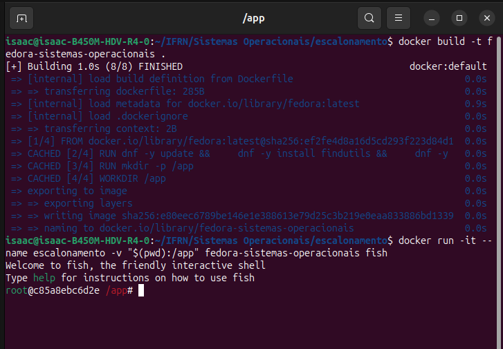
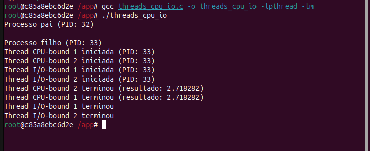
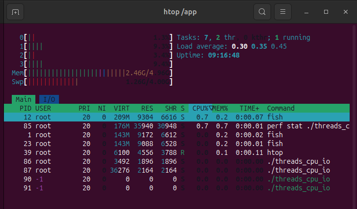
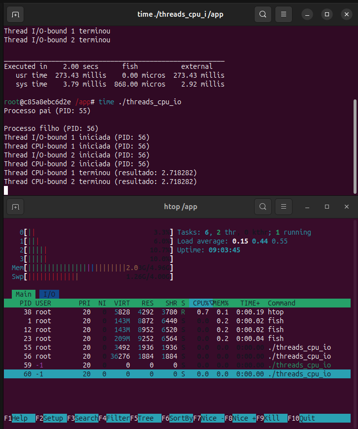
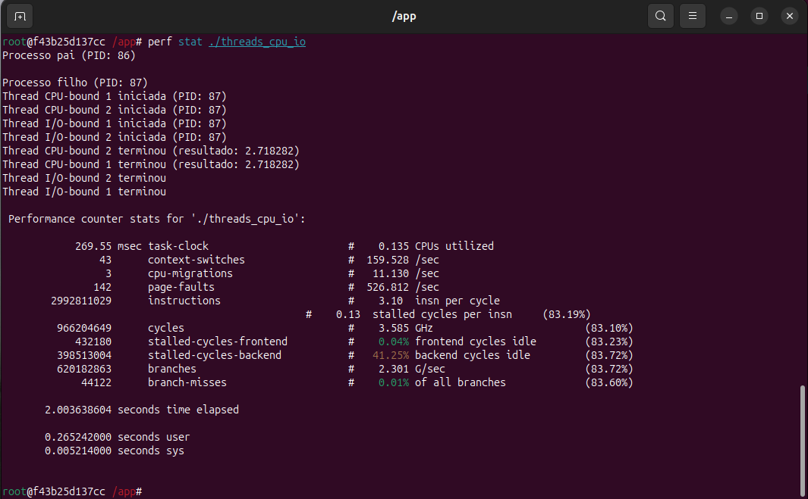

# Atividade 04 — Escalonamento de Tarefas

## 👨‍💻 Aluno

- Nome: Isaac Lira  
- GitHub: [@IsaacLira42](https://github.com/IsaacLira42)

---

## 🎯 Objetivo

O foco da atividade foi entender melhor a diferença entre dois tipos de threads:

- **CPU-bound**: fazem muito cálculo e exigem bastante do processador
- **I/O-bound**: simulam operações de entrada e saída, e passam mais tempo esperando

A ideia foi rodar um programa com esses dois tipos de thread e observar como o sistema operacional lida com elas.

---

## ⚙️ Ambiente usado

- Ubuntu 25.04
- Docker com imagem Fedora
- Shell: fish

---

## 🛠️ Etapas da execução

### 🐳 Criando e rodando o contêiner



---

### 🔧 Compilando e executando o programa em C

```bash
gcc threads_cpu_io.c -o threads_cpu_io -lpthread -lm
./threads_cpu_io
````



---

## 📊 Monitoramento e análise

### 📈 `htop` e `perf` durante a execução

Durante a execução, deu pra ver que as threads CPU-bound puxam muito mais CPU, enquanto as I/O-bound quase não usam o processador (elas basicamente ficam esperando).



---

### ⏱️ Medindo o tempo com `time`

Com o comando `time`, consegui ver quanto tempo total o programa levou, e quanto tempo foi gasto de fato no processador:

```bash
time ./threads_cpu_io
```



---

### 📊 Métricas mais detalhadas com `perf stat`

O `perf` mostrou números mais técnicos, como ciclos de CPU, instruções executadas e tempo de execução.

```bash
perf stat ./threads_cpu_io
```



---

## 🔍 O que foi possível perceber

### Comportamento das threads:

* As **CPU-bound** aparecem no `htop` com alto uso de CPU — elas estão sempre rodando.
* Já as **I/O-bound** só usam CPU por alguns instantes e passam mais tempo em espera.

### Diferença nos tempos:

* O tempo `real` é o total, contando com o tempo das esperas.
* O tempo `user` + `sys` mostra o que foi gasto processando de fato.

### Com o `perf`:

* Muitas instruções e ciclos mostram que as CPU-bound exigem muito da máquina.
* O Linux tenta equilibrar o uso da CPU entre as threads, mas dá mais atenção às que estão prontas (geralmente as CPU-bound).

---

## ✅ Conclusão

A prática ajudou a visualizar na prática como o sistema operacional lida com tipos diferentes de threads. Também deu pra entender como usar ferramentas como `htop`, `time` e `perf` pra investigar o que está acontecendo na máquina enquanto os processos rodam.

---

## 🧾 Comandos que usei

```bash
# Compilar
gcc threads_cpu_io.c -o threads_cpu_io -lpthread -lm

# Rodar o programa
./threads_cpu_io

# Ver tempo de execução
time ./threads_cpu_io

# Ver estatísticas detalhadas
perf stat ./threads_cpu_io

# Monitorar em tempo real
htop
```